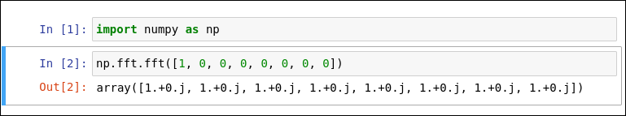

# ipython-cells

This is an IPython extension for those who prefer to work in a terminal but still need the cell-by-cell execution provided by a Jupyter notebook.

Example Jupyter notebook:



Running exported notebook with ipython-cells:


## Quickstart

Install the extension:

    pip install ipython-cells
    
Convert an existing notebook to a Python file (In Jupyter):

    Cell > Run All
    File > Download As > python (.py)

Execute cells in iPython:

``` python
>>> %load_ext ipython_cells
>>> %load_file my_notebook.py
>>> %cell_run 1
>>> %cell_run 2
array([1.+0.j, 1.+0.j, 1.+0.j, 1.+0.j, 1.+0.j, 1.+0.j, 1.+0.j, 1.+0.j])
```

You can freely add/delete/rename cells in the downloaded `my_notebook.py`.  `my_notebook.py` is automatically reloaded when changes are made.
   
Alternatively, you can create a new .py file from scratch without starting from a Jupyter notebook.  See the [cell delimiter syntax](#cell-delimiter-syntax).

## Other Features

Spyder cell delimiter syntax is also supported:

``` python
# %% cell1
print('hello')

# %% cell2
print('world')
```

Other commands:

``` python
# cell ranges - run all cells from beginning of file to cell2 (inclusive)
>>> %cell_run ^cell2
hello
world

# cell ranges - run all cells from cell1 (inclusive) to end of file
>>> %cell_run cell1$
hello
world

# list available cells for running
>>> %list_cells
['__first', 'cell1', 'cell2']
```


## Automatically Load Extension

To load extension on IPython start, add this to `~/.ipython/profile_default/ipython_config.py`

``` python
c.InteractiveShellApp.extensions = [
    'ipython_cells'
]
```

## Autoreloading
``` python
# load example.py with autoreloading
%load_file example.py

%cell_run cell1
10
# example.py is modified by an external editor (e.g. `a = 10`  ->  `a = 20`)
# File change is detected and automatically reloaded
%cell_run cell1
20

```

Auto reloading can be disabled with `%load_file example.py --noreload`

## Cell Delimiter Syntax

Cells are delimited by special comments.  Both Jupyter and Spyder style cells are supported.  Below are different variations of a cell called `foobar_cell`.

- `# %% foobar_cell`
- `# In[foobar_cell]`
- `# %% foobar_cell some extra text`
- `# In[foobar_cell] some extra text`

## Running Exported Jupyter Notebooks

This extension can run exported Jupyter notebooks. (`File > Download As > python (.py)`).

Be sure to run all cells before exporting so they are assigned an index. (`Cell > Run All`).

## Tests

    cd tests
    ipython3 tests.py
